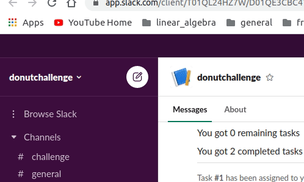

# Assigner bot

Assigner bot is a slack bot that gives users the ability to assign tasks to each others

## TOC
- [Assigner bot](#assigner-bot)
  - [TOC](#toc)
    - [Versions](#versions)
    - [How to run](#how-to-run)
    - [Todos](#todos)
    - [Sample run](#sample-run)

### Versions

| **Name** | **Version**|
| --- | --- |
| Ruby | 3.0.0 |
| RoR | 6.1.3 |

### How to run

1. Run `bundle install`
2. Run `rails db:create`
3. Run `rails db:migrate` (Optionally followed by `rails db:seed` it will basically import current slack users)
4. Install ngrok an run it locally using `ngrok http 3000`
5. Copy the hostname and add to `.env` file in the project root directory as an environment variable with name `HOSTNAME`
6. Add `SLACK_API_TOKEN` to .env or as an environment variable
7. Run `rails s`
8. Change callback urls on slack according to hostname generated by ngrok

### Todos
- [x] create and assign task
- [x] list my remaining tasks
- [x] list my completed tasks
- [x] mark my task as complete
- [ ] list my reported tasks
- [ ] dockerize the app
- [ ] switch to postgresql
- [ ] add github actions flow

### Sample run
